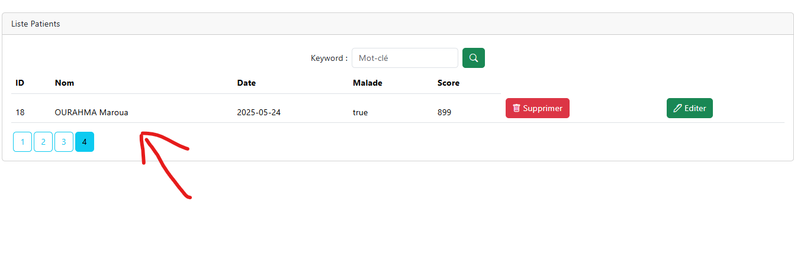
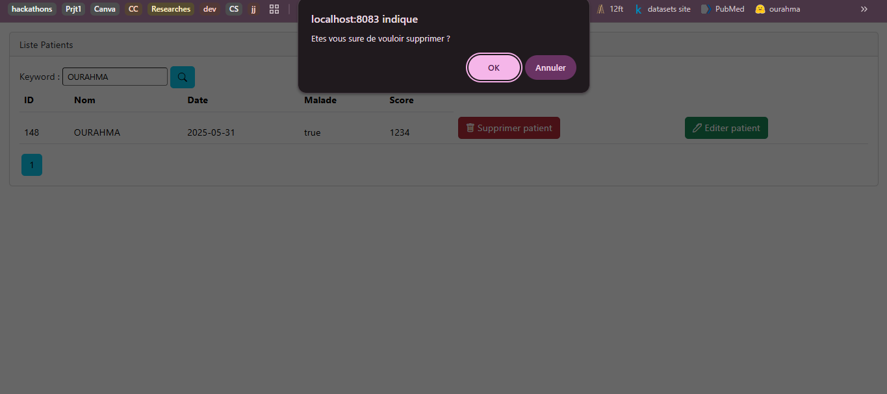
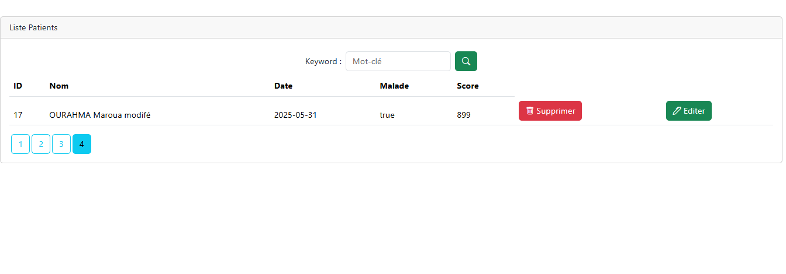
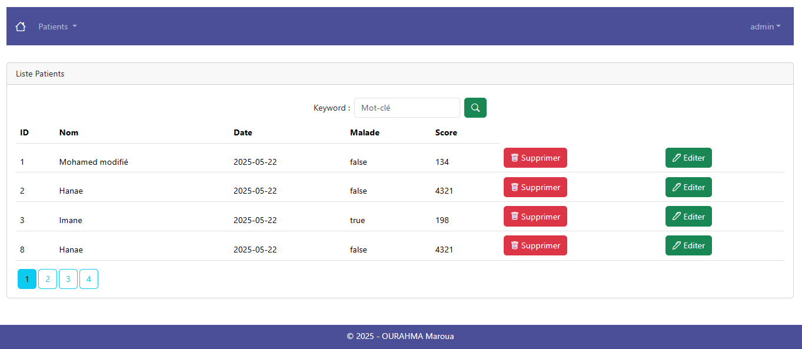
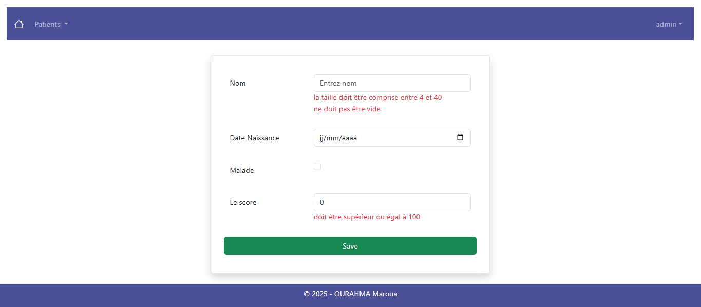
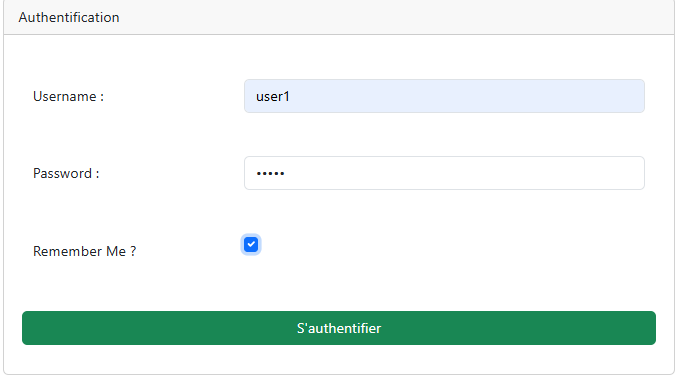
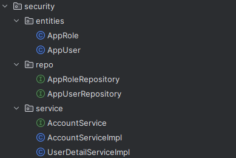
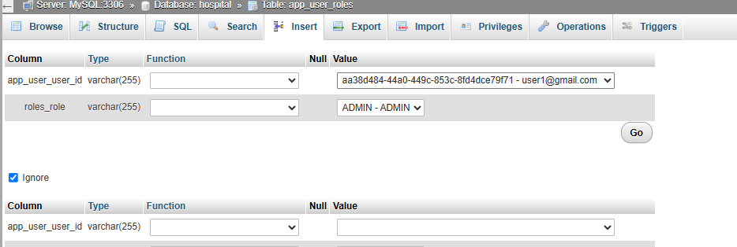
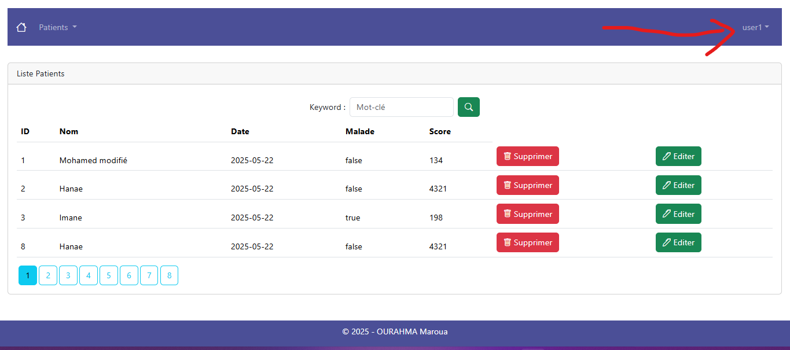

# Spring MVC

* Nom : OURAHMA.
* Prènom : Maroua.
* Filière : Master en Intelligence artificielle et sciences de données
* Universitè : Facultès des sciences Universitè Moulay Ismail Meknès.

## **1. Introduction**

Ce rapport présente le développement d'une application Web JEE basée 
sur le framework Spring MVC, intégrant les technologies Thymeleaf 
pour la partie front-end et Spring Data JPA pour la gestion de la 
persistance des données, en mettant en œuvre des 
fonctionnalités classiques d’une application de gestion, ainsi 
que des notions avancées telles que la pagination, la recherche 
dynamique, la validation de formulaires et la gestion de la 
sécurité avec Spring Security.
___
## **2. Enoncé**

Développer une application Web JEE de gestion des patients en utilisant :

- **Spring MVC** pour la gestion des contrôleurs et de la logique métier,

- **Thymeleaf** pour le rendu des pages web côté client,

- **Spring Data JPA** pour l’interaction avec la base de données relationnelle.

**Fonctionnalités attendues **

- Afficher la liste des patients avec pagination.
- Rechercher des patients par nom.
- Supprimer un patient de la base de données.
- Ajouter et modifier les patients avec validation des formulaires.
- Améliorations supplémentaires possibles (ex. tri, notifications, etc.).

**Partie sécurité (Spring Security) **
- L’application sera sécurisée à l’aide de Spring Security avec trois modes d’authentification :

    - **InMemory Authentication** (utilisateurs stockés en mémoire),
    - **JDBC Authentication** (utilisateurs stockés dans la base de données),
    - **UserDetailsService** personnalisé.

Les rôles `USER` et `ADMIN` permettront de restreindre l’accès à 
certaines fonctionnalités, comme la suppression de patients ou 
l’accès à l’interface d’administration.
___

## **3. Partie 1**
### Introduction :
La première étape du projet consiste à poser les bases de 
l’application en créant la structure principale : les entités, 
la base de données, les contrôleurs, ainsi que les vues HTML 
avec Bootstrap. L’objectif est de mettre 
en œuvre les opérations CRUD (Créer, Lire, Mettre à jour, Supprimer) 
sur une entité principale : `Patient`. Une fonctionnalité 
de recherche par nom ou partie du nom des patients est 
également intégrée, avec une interface utilisateur conviviale.

**1. Création de l'entité `Patient`**
- Définition de la classe Patient annotée avec `@Entity`, contenant 
des attributs comme `id`, `nom`, `dateNaissance`, `malade`, et `score`.
```java
package net.ourahma.entities;

import java.util.Date;

import jakarta.persistence.*;
import jakarta.validation.constraints.DecimalMin;
import jakarta.validation.constraints.NotEmpty;
import jakarta.validation.constraints.Size;
import lombok.AllArgsConstructor;
import lombok.Data;
import lombok.NoArgsConstructor;
import lombok.Builder;
import org.springframework.format.annotation.DateTimeFormat;


@Entity
@Data @NoArgsConstructor @AllArgsConstructor
@Builder
public class Patient {
    @Id @GeneratedValue(strategy = GenerationType.IDENTITY)
    private Long id;

    @NotEmpty
    @Size(min = 4, max = 40)
    private String nom;
    @Temporal(TemporalType.DATE)
    @DateTimeFormat(pattern = "yyyy-MM-dd")
    private Date dateNaissance;
    private boolean malade;
    @DecimalMin("100")
    private int score;
}

```
**Annotations Utilisées**

**Annotations JPA (Jakarta Persistence API)**

- `@Entity` : Indique que cette classe est une entité persistante, elle sera mappée à une table en base de données.
- `@Id` : Spécifie que le champ `id` est la clé primaire de l'entité.
- `@GeneratedValue(strategy = GenerationType.IDENTITY)` : La clé primaire est générée automatiquement par la base de données (auto-increment).
- `@Temporal(TemporalType.DATE)` : Indique que le champ `dateNaissance` est de type `DATE` en base de données (sans l'heure).
- `@DateTimeFormat(pattern = "yyyy-MM-dd")` : Permet de formater la date lors de la saisie ou l'affichage au format `YYYY-MM-DD`.
---

**Annotations Lombok**

Lombok permet de générer automatiquement du code répétitif comme les getters, setters, constructeurs, etc.

- `@Data` : Génère automatiquement les getters, setters, `toString`, `equals`, `hashCode`, etc.
- `@NoArgsConstructor` : Génère un constructeur sans arguments.
- `@AllArgsConstructor` : Génère un constructeur avec tous les champs.
- `@Builder` : Permet de construire facilement des objets avec le pattern Builder.

**Exécution**
- La table des patients est affiché dans la base de données après avoir ajouté des patients en tuilisant l'objet de `CommandLineRunner`
```java
package net.ourahma;

import net.ourahma.entities.Patient;
import net.ourahma.repository.PatientRepository;
import org.springframework.beans.factory.annotation.Autowired;
import org.springframework.boot.CommandLineRunner;
import org.springframework.boot.SpringApplication;
import org.springframework.boot.autoconfigure.SpringBootApplication;
import org.springframework.context.annotation.Bean;
import org.springframework.security.crypto.bcrypt.BCryptPasswordEncoder;
import org.springframework.security.crypto.password.PasswordEncoder;

import java.util.Date;

@SpringBootApplication
public class Hospital2Application  {
    @Autowired
    private PatientRepository patientRepository;
    public static void main(String[] args) {
        SpringApplication.run(Hospital2Application.class, args);
    }

    //@Bean
    CommandLineRunner commandLineRunner(PatientRepository patientRepository) {
        return args -> {
            // trois façons pour insérer des patients
            // 1 ere méthode
            Patient patient = new Patient();
            patient.setId(null);
            patient.setNom("OURAHMA");
            patient.setDateNaissance(new Date());
            patient.setMalade(false);
            patient.setScore(23);
            //patientRepository.save(patient);

            // 2 eme méthode
            Patient patient2 = new Patient(null,"OURAHMA MAROUA",new Date(),false, 123);
            //patientRepository.save(patient2);

            // 3 eme méthode : en utilisant builder
            Patient patient3= Patient.builder()
                    .nom("Maroua")
                    .dateNaissance(new Date())
                    .score(56)
                    .malade(true)
                    .build();
            //patientRepository.save(patient3);

            patientRepository.save(new Patient(null,"Mohamed",new Date(),false,134));
            patientRepository.save(new Patient(null,"Hanae",new Date(),false,4321));
            patientRepository.save(new Patient(null,"Imane",new Date(),true,198));
            patientRepository.findAll().forEach(p ->{
                System.out.println(p.getNom());
            });
        };
    }
}

```
- Les patients sont bien ajoutés dans la base de données comme indiqué içi:


**2. Mise en place de la couche DAO **

- Création de l’interface `PatientRepository` qui étend `JpaRepository<Patient, Long>`.
- Définition d’une méthode personnalisée pour la recherche :
```java
package net.ourahma.repository;

import lombok.AllArgsConstructor;
import net.ourahma.entities.Patient;
import org.springframework.data.domain.Page;
import org.springframework.data.domain.Pageable;
import org.springframework.data.jpa.repository.JpaRepository;
import org.springframework.data.jpa.repository.Query;
import org.springframework.data.repository.query.Param;
import org.springframework.stereotype.Repository;

@Repository
public interface PatientRepository extends JpaRepository<Patient, Long> {
    Page<Patient> findByNomContains(String keyword, Pageable pageable);

    @Query("select p from Patient p where p.nom like :x")
    Page<Patient> chercher(@Param("x") String x, Pageable pageable);
}
```
- **Annotations utilisées dans PatientRepository**

  - `@Repository` : Marque l'interface comme un repository Spring, permettant la gestion automatique par le framework.
  - `@Query` : Permet d’écrire une requête JPQL personnalisée (au lieu d'utiliser les méthodes générées automatiquement).
  - `@Param` : Associe un paramètre de méthode à un paramètre nommé dans une requête JPQL.

- **3. Création du contrôleur web (`PatientController`)**
  Chaque méthode du contrôleur gère une action spécifique dans l'application :

- `index(Model model, @RequestParam...)`  
  Affiche la liste paginée des patients. Permet également de faire une recherche par nom.
- `delete(@RequestParam...)`  
  Supprime un patient par son ID.

- `home()`  
  Redirige la racine du site (`/`) vers la page d'accueil des patients.
- `listPatients()`  
  Retourne une liste de tous les patients.
- `formPatient(Model model)`  
  Affiche le formulaire d'ajout d'un nouveau patient. Réservé aux administrateurs.

- `save(Model model, @Valid Patient patient, BindingResult...)`  
  Enregistre un nouveau patient ou met à jour un existant après validation des données du formulaire.
- `editPatient(Model model, Long id, String keyword, int page)`  
  Charge les informations d’un patient existant pour modification.
```java
package net.ourahma.web;

import jakarta.validation.Valid;
import lombok.AllArgsConstructor;
import net.ourahma.entities.Patient;
import net.ourahma.repository.PatientRepository;
import org.springframework.beans.factory.annotation.Autowired;
import org.springframework.data.domain.Page;
import org.springframework.data.domain.PageRequest;
import org.springframework.security.access.prepost.PreAuthorize;
import org.springframework.stereotype.Controller;
import org.springframework.ui.Model;
import org.springframework.validation.BindingResult;
import org.springframework.web.bind.annotation.GetMapping;
import org.springframework.web.bind.annotation.PostMapping;
import org.springframework.web.bind.annotation.RequestParam;

import java.util.List;

@Controller
@AllArgsConstructor
public class PatientController {

    @Autowired
    private PatientRepository patientRepository;

    @GetMapping("/index")
    public String index(Model model,
                        @RequestParam(name = "page", defaultValue = "0") int page ,
                        @RequestParam(name = "size", defaultValue = "4") int size,
                        @RequestParam(name = "keyword", defaultValue = "") String kw ){
        // @RequestParam(name = "page"): on lui dit va chercher un paramètre qui s appemme page
        // sans faire la pagination
        //List<Patient> patientList= patientRepository.findAll();
        // integrer la pagination
        Page<Patient> pagePatients= patientRepository.findByNomContains(kw, PageRequest.of(page, size));
        // en utilisant getContent, le contenu de la page est retourné à ce point là est la liste des patients
        model.addAttribute("Listpatients", pagePatients.getContent());
        // stocker le nombre de pages
        model.addAttribute("pages",new int[pagePatients.getTotalPages()]);
        // stocker la page courante pour la colorier
        model.addAttribute("currentPage",page);
        // stocker la valeur de keyword pour l 'affichier après
        model.addAttribute("keyword",kw);
        return "Patients";
    }
    // supprimer les patients
    @GetMapping("/delete")
    @PreAuthorize("hasRole('ROLE_ADMIN')")
    public String delete(@RequestParam(name="id") Long id,
                          @RequestParam(name = "keyword", defaultValue = "") String keyword,
                          @RequestParam(name = "page", defaultValue = "0") int page){
        patientRepository.deleteById(id);
        return "redirect:/user/index?page="+page+"&keyword="+keyword;
    }
    //
    @GetMapping("/")
    public String home(){
        return "redirect:/user/index";
    }
    @GetMapping("/patients")
    public List<Patient> listPatients(){
        return patientRepository.findAll();
    }

    @GetMapping("/formPatients")
    @PreAuthorize("hasRole('ROLE_ADMIN')")
    public String formPatient(Model model){
        model.addAttribute("patient", new Patient());
        return "formPatients";
    }

    @PostMapping("/save")
    @PreAuthorize("hasRole('ROLE_ADMIN')")
    public String save(Model model, @Valid Patient patient, BindingResult bindingResult,
                       @RequestParam(name = "keyword", defaultValue = "") String keyword,
                       @RequestParam(name = "page", defaultValue = "0") int page){
        if(bindingResult.hasErrors()){
            return "formPatients";
        }else{
            model.addAttribute("keyword", keyword);
            model.addAttribute("page", page);
            patientRepository.save(patient);
            return "redirect:/user/index?page="+page+"&keyword="+keyword;
        }
    }
    @GetMapping("/editPatient")
    public String editPatient(Model model, Long id, String keyword, int page){
        Patient patient = patientRepository.findById(id).orElse(null);
        if(patient == null)throw new RuntimeException("Patient introuvable");
        model.addAttribute("patient", patient);
        model.addAttribute("keyword", keyword);
        model.addAttribute("page", page);
        return "editPatients";
    }
}

```
**Annotations utilisées dans PatientController**

- `@Controller` : Indique que cette classe est un contrôleur Spring MVC (retourne des noms de vues).
- `@GetMapping` : Mappe une méthode sur une requête HTTP GET avec l'URL spécifiée.
- `@PostMapping` : Mappe une méthode sur une requête HTTP POST.
- `@RequestParam` : Récupère un paramètre depuis l’URL (ex: ?page=1).
- `@Valid` : Déclenche la validation d’un objet selon les contraintes définies.
- `@PathVariable` : Récupère une variable directement depuis l’URL (non utilisé ici, mais courant).
- `@ModelAttribute` : Lie les données du formulaire à un objet Java (non présent ici, mais souvent utilisé).

**4. La page `patients.html` **
```html
<!DOCTYPE html>
<html lang="en" xmlns:th="http://www.thymeleaf.org"
      xmlns:layout="http://www.ultraq.net.nz/thymeleaf/layout"
        >
<head>
    <meta charset="UTF-8">
    <title>Patients</title>
    <link rel="stylesheet" href="/webjars/bootstrap/5.3.5/css/bootstrap.min.css">
    <link rel="stylesheet" href="/webjars/bootstrap-icons/1.11.1/font/bootstrap-icons.css">
</head>
<body>
<div class="p-3">
    <div class="card">
        <div class="card-header">Liste Patients</div>
        <div class="card-body">
            <form method="get" th:action="@{/user/index}">
                <label >Keyword : </label>
                <input class="form-control-sm" type="text" name="keyword" th:value="${keyword}">
                <button type="submit" class="btn btn-info">
                    <i class="bi bi-search"></i>
                </button>
            </form>
            <table class="table">
                <thead>
                <th>ID</th><th>Nom</th><th>Date</th><th>Malade</th><th>Score</th>


                <tr th:each="p:${Listpatients}">
                    <td th:text="${p.id}"></td>
                    <td th:text="${p.nom}"></td>
                    <td th:text="${p.dateNaissance}"></td>
                    <td th:text="${p.malade}"></td>
                    <td th:text="${p.score}"></td>
                    <td th:if="${#authorization.expression('hasRole(''ADMIN'')')}">
                        <a
                                onclick="javascript:return confirm('Etes vous sure de vouloir supprimer ? ')"
                                th:href="@{/admin/delete(id=${p.id}, keyword=${keyword}, page=${currentPage})}"
                                class="btn btn-danger"><i class="bi bi-trash"></i> Supprimer patient</a>
                    </td>
                    <td th:if="${#authorization.expression('hasRole(''ADMIN'')')}">
                        <a
                                th:href="@{/admin/editPatient(id=${p.id}, keyword=${keyword}, page=${currentPage})}"
                                class="btn btn-success"><i class="bi bi-pen"></i> Editer patient</a>
                    </td>
                </tr>
                </thead>
            </table>
            <ul class="nav nav-pills">
                <li th:each="value, item:${pages}">
                    <a th:href="@{/user/index(page=${item.index}, keyword=${keyword})}"
                       th:class="${currentPage==item.index?'btn btn-info ms-1':'btn btn-outline-info ms-1'}"
                       th:text="${1+item.index}"></a>
                </li>
            </ul>
        </div>
    </div>

</div>
</body>
</html>
```

#### **L'exécution de cette partie**

- **Le résultat de l'exéution avec pagination**
  
  - la page patients.html donne la possibilité de supprimer, éditer un patient.
- **l'ajout des patients**
  
    - Cette page permet d'ajouter un patient en saisissant le nom, la date de naissance
    le checkbox pour checker s'il est malade ou non et le score.
    - Le patient par la suite est enregistré dans la base de données et récuperer dans la page `patient.html`:
      
  
- **La rechercher des patients**
  - Cette page représente la possibilité de rechercher des personnes celon le 
  nom de patient, le paramètre keyword est ajouté au lien pour chercher dans
  la base de données en utilisant la méthode `findUserByNom` dans le Repository `PatientRepository`
  
- **La suppression des patients**
  - Cette fontionnalité est pour supprimer un patient après avoir confirmé la suppression en utilisant `javaScript`
  

- **L'édition d'un `Patient`**
  - Après selectionner un patient qu'on veut selctionner, le patient est cherché par son Id est retourné à la page en utilisant le `Model`.
  
  - Le patient est sauveguaré en utilisant la même fontion `save()` utillisé pour le créer, voici le résultat :
  
___
## **4. Partie 2**
- Cette partie a pour but de créer une template et de faire la validation do formulaire en utilisant les dependencies.

1. L’utilisation du moteur de template **Thymeleaf** avec `spring-boot-starter-thymeleaf` pour créer des vues HTML dynamiques et réutilisables grâce au système de layout.
   - Ce fichier représente la structure de base d’une page HTML dans 
   l’application Spring Boot, utilisant le moteur de template Thymeleaf . 
   Il contient une barre de navigation dynamique avec gestion des rôles
   utilisateur, un espace réservé pour le contenu spécifique à chaque page
   `(layout:fragment="content1")`, ainsi qu’un pied de page simple. Ce template est utilisé pour assurer une cohérence visuelle entre les différentes vues de l’application.
- La page `template.html`:
```html
<!DOCTYPE html>
<html lang="en" xmlns:th="http://www.thymeleaf.org"
      xmlns:layout="http://www.ultraq.net.nz/thymeleaf/layout">
<head>
    <meta charset="UTF-8">
    <title>Title</title>
    <link rel="stylesheet" type="text/css" href="/webjars/bootstrap/5.3.5/css/bootstrap.min.css">
    <link rel="stylesheet" href="/css/style.css">
    <script src="/webjars/bootstrap/5.3.5/js/bootstrap.bundle.js"></script>
</head>
<body>
<nav class="navbar navbar-expand-lg navbar-dark p-3 m-3 navbar-custom" >
    <a class="navbar-brand" th:href="@{/user/index}"><i class="bi bi-house"></i></a>
    <button class="navbar-toggler" type="button" data-toggle="collapse"
            data-target="#navbarSupportedContent" aria-controls="navbarSupportedContent"
            aria-expanded="false" aria-label="Toggle navigation">
        <span class="navbar-toggler-icon"></span>
    </button>

    <div class="collapse navbar-collapse" id="navbarSupportedContent">
        <ul class="navbar-nav mr-auto">

            <li class="nav-item dropdown">
                <a class="nav-link dropdown-toggle" href="#" id="navbarDropdown" role="button"
                   data-bs-toggle="dropdown" aria-expanded="false">
                    Patients
                </a>
                <ul class="dropdown-menu" aria-labelledby="navbarDropdown">
                    <li th:if="${#authorization.expression('hasRole(''ADMIN'')')}">
                        <a class="dropdown-item" th:href="@{/formPatients}">
                            <i class="bi bi-person-plus p-2"></i>Nouveau Patient</a>
                    </li>
                    <li><a class="dropdown-item" th:href="@{/user/index}">
                        <i class="bi bi-search p-2"></i> Chercher</a></li>
                </ul>
            </li>

        </ul>
        <ul class="navbar-nav ms-auto">
            <li class="nav-item dropdown">
                <a class="nav-link dropdown-toggle" href="#" id="UserDropdown" role="button"
                   data-bs-toggle="dropdown" aria-expanded="false"
                   th:text="${#authentication.name}">
                </a>
                <ul class="dropdown-menu dropdown-menu-end" aria-labelledby="UserDropdown">
                    <li>
                    <form method="post" th:action="@{/logout}">
                        <!--fermet la session coté serveur et le cookie va etre supprimé-->
                        <button type="submit" class="dropdown-item" >
                            <i class="bi bi-box-arrow-right p-2"></i>Logout</button>
                    </form>
                    </li>
                </ul>
            </li>
        </ul>

    </div>
</nav>
<section layout:fragment="content1"></section>
<footer >
    <small>&copy; 2025 - OURAHMA Maroua</small>
</footer>

</body>
</html>
```
**La gestion de layout avec Thymleaf.**
- `<section layout:fragment="content1"></section>` :
  - C’est ici que chaque page concrète injectera son propre contenu grâce au système de layout de Thymeleaf.
  - Permet de réutiliser cette structure commune sans avoir à tout redéfinir à chaque fois.
- Le contenu de chaque page est entouré de template :
  
2. La **validation des données utilisateur** grâce à `spring-boot-starter-validation`, qui permet d’assurer la qualité des données saisies dans les formulaire.
   - Pour ce faire, les décorateurs de validation des données doivent être ajouté dans la classe `Patient.java`:
```java
package net.ourahma.entities;

import java.util.Date;

import jakarta.persistence.*;
import jakarta.validation.constraints.DecimalMin;
import jakarta.validation.constraints.NotEmpty;
import jakarta.validation.constraints.Size;
import lombok.AllArgsConstructor;
import lombok.Data;
import lombok.NoArgsConstructor;
import lombok.Builder;
import org.springframework.format.annotation.DateTimeFormat;


@Entity
@Data @NoArgsConstructor @AllArgsConstructor
@Builder
public class Patient {
    @Id @GeneratedValue(strategy = GenerationType.IDENTITY)
    private Long id;
    @NotEmpty
    @Size(min = 4, max = 40)
    private String nom;
    @Temporal(TemporalType.DATE)
    @DateTimeFormat(pattern = "yyyy-MM-dd")
    private Date dateNaissance;
    private boolean malade;
    @DecimalMin("100")
    private int score;
}
```
**Annotations de Validation (Jakarta Validation)**

- `@NotEmpty` : Le champ `nom` ne peut pas être vide.
- `@Size(min = 4, max = 40)` : La taille du `nom` doit être entre 4 et 40 caractères.
- `@DecimalMin("100")` : Le `score` doit être supérieur ou égal à 100.
- L'utilisation de `BindingResult` dans la fontion `save()` dans le controlleur :
```java
public String save(Model model, @Valid Patient patient, BindingResult bindingResult,
                   @RequestParam(name = "keyword", defaultValue = "") String keyword,
                   @RequestParam(name = "page", defaultValue = "0") int page){
if(bindingResult.hasErrors()){
            return "formPatients";
        }else {
    model.addAttribute("keyword", keyword);
    model.addAttribute("page", page);
    patientRepository.save(patient);
    return "redirect:/user/index?page=" + page + "&keyword=" + keyword;
}
        }
```

L'objet `BindingResult` est utilisé ici pour **capturer les erreurs de validation** après la soumission du formulaire.

- Lorsque l'utilisateur soumet le formulaire d'ajout ou d'édition d'un patient, l'annotation `@Valid` déclenche la validation des champs selon les contraintes définies dans l'entité `Patient` (ex. `@NotEmpty`, `@Size`, `@DecimalMin`).
- Si des erreurs sont trouvées, `bindingResult.hasErrors()` renvoie `true`, et la méthode retourne à la vue `"formPatients"` pour afficher les messages d'erreur.
- Si tout est valide, l'enregistrement ou la mise à jour du patient est effectuée, puis l'utilisateur est redirigé vers la liste paginée des patients.

Ainsi, `BindingResult` permet de gérer simplement la **validation côté serveur** et d’afficher des retours utilisateur précis en cas d’erreurs.

- lorsque l'utilisateur ajout des patients les données sont validées avant de enregister le patient.

___
## **5. Partie 3**
Dans cette partie, nous allons explorer les différentes approches permettant de gérer l’authentification des utilisateurs dans l’application Spring Boot. Ces méthodes offrent des niveaux de complexité et de sécurité différents, adaptés à divers contextes de développement.

### 1. In Memory Authentification :
Une solution simple et rapide pour tester l’authentification avec quelques utilisateurs définis statiquement dans le fichier de configuration ou directement en Java.
```java
// définir les utilisateurs qui ont droit d 'accéder à l'application
    @Bean
    public InMemoryUserDetailsManager inMemoryUserDetailsManager(PasswordEncoder passwordEncoder){
        String encodedPassword = passwordEncoder.encode("1234");
        System.out.println(encodedPassword);
        return new InMemoryUserDetailsManager(
                User.withUsername("user1").password(encodedPassword).roles("USER").build(),
                User.withUsername("user2").password(encodedPassword).roles("USER").build(),
                User.withUsername("admin").password(encodedPassword).roles("USER","ADMIN").build()
        );
    }
```
**Les annotations importantes**
- **`@Bean`** : cette méthode créerait un *bean* Spring géré automatiquement par le conteneur IoC.

- **`PasswordEncoder`** : Utilisé pour encoder les mots de passe avant de les stocker (même si c’est en mémoire).  
  → Le mot de passe `"1234"` est encodé via la méthode `encode()`, ce qui permet de simuler une gestion sécurisée des mots de passe.

- **`InMemoryUserDetailsManager`** : Classe fournie par Spring Security pour gérer les utilisateurs en mémoire.

- **`User.withUsername(...)`** : Construit un utilisateur avec :
  - Un nom d’utilisateur
  - Un mot de passe encodé
  - Un ou plusieurs rôles (ex: `"USER"`, `"ADMIN"`)
### 2. jdbc Authentification :
Utilisation d’une base de données relationnelle pour stocker les informations des utilisateurs et leurs rôles. Cette méthode est plus proche d’un cas réel et offre une meilleure scalabilité.
```java
 //JDBC authentication
    @Bean
    public JdbcUserDetailsManager jdbcUserDetailsManager(DataSource dataSource){
        // spécifier le data source, où on a les rôles et les tables
        return new JdbcUserDetailsManager(dataSource);
    }
```
- Spring Boot injecte automatiquement un objet `DataSource`, qui est configuré via le fichier application.properties.
- `JdbcUserDetailsManager` utilise ce DataSource pour charger les informations des utilisateurs (nom d’utilisateur, mot de passe, rôles) à partir des tables définies dans la base.

**Le data source**
- le data source est sauveguardé dans le fichier `schema.sql` est configuré dans le fichier `application.properties`:
```sql
create table if not exists users(username varchar(50) not null primary key,password varchar(500) not null,enabled boolean not null);
create table if not exists authorities (username varchar(50) not null,authority varchar(50) not null,constraint fk_authorities_users foreign key(username) references users(username));
create unique index ix_auth_username on authorities (username,authority);
```
**Ajouter des utilisateurs avec leur rôles**
- Des utilisateurs de test ont été créer dans le fichier `HospitalApplication.java` avec le décorateur `@Bean` pour qu'elle s'éxécute automatiquement à chaque démarrage :
```java
 @Bean
    CommandLineRunner commandLineRunner(JdbcUserDetailsManager jdbcUserDetailsManager){
        PasswordEncoder passwordEncoder = passwordEncder();
        return args ->{

            if(!jdbcUserDetailsManager.userExists("user11")){
                jdbcUserDetailsManager.createUser(User.withUsername("user11").password(passwordEncoder.encode("1234")).roles("USER").build());
            }
            if(!jdbcUserDetailsManager.userExists("user22")){
                jdbcUserDetailsManager.createUser(User.withUsername("user22").password(passwordEncoder.encode("1234")).roles("USER").build());
            }
            if(!jdbcUserDetailsManager.userExists("admin2")){
                jdbcUserDetailsManager.createUser(User.withUsername("admin2").password(passwordEncoder.encode("1234")).roles("USER","ADMIN").build());
            }

        };
    }
```
- `JdbcUserDetailsManager` : Utilisé pour gérer les utilisateurs stockés dans une base de données.
- `PasswordEncoder` : Encode les mots de passe avant de les sauvegarder dans la base, pour plus de sécurité.
- Création des utilisateurs avec le nom, mot de passe encodé et le rôle.

- l'authentification avec `jdbcUserDetails` :

### 3. UserDetails Service :
Cette partie présente une approche plus flexible et professionnelle pour gérer les utilisateurs dans une application Spring Boot. Elle permet de charger les détails de l’utilisateur à partir d’une source personnalisée (ici, une base de données via JPA), plutôt que d’utiliser des configurations statiques ou limitées comme l’authentification en mémoire ou JDBC basique.

- **L'architecture de package `secutiry`**
Il s'agit de créer des nouvelles entité d'utilisateur et de rôle aussi les repository et l'interface de Service avec son implmentation.

    

1. **Entities**
  - `AppUser.java`
```java
package net.ourahma.security.entities;

import jakarta.persistence.*;
import lombok.AllArgsConstructor;
import lombok.Builder;
import lombok.Data;
import lombok.NoArgsConstructor;

import java.util.List;

@Entity
@Data @NoArgsConstructor @AllArgsConstructor @Builder
public class AppUser {
    @Id
    private String userId;
    @Column(unique = true)
    private String username;
    private String password;
    private String email;
    @ManyToMany(fetch = FetchType.EAGER)
    private List<AppRole> roles;
}

```
- `AppRole.java`
````java
package net.ourahma.security.entities;

import jakarta.persistence.Entity;
import jakarta.persistence.Id;
import lombok.AllArgsConstructor;
import lombok.Builder;
import lombok.Data;
import lombok.NoArgsConstructor;

@Entity
@Data @NoArgsConstructor @Builder
@AllArgsConstructor
public class AppRole {
    @Id
    private String role;
}

````
- Représentent les utilisateurs et leurs rôles dans la base de données.
- Utilisent JPA pour le mapping objet-relationnel.
2. **Repository**
- `AppRoleRepository.java`
````java
package net.ourahma.security.repo;

import net.ourahma.security.entities.AppRole;
import org.springframework.data.jpa.repository.JpaRepository;

public interface AppRoleRepository extends JpaRepository<AppRole, String> {

}

````
- `AppUserReposotory.java`
```java
package net.ourahma.security.repo;

import net.ourahma.security.entities.AppUser;
import org.springframework.data.jpa.repository.JpaRepository;

public interface AppUserRepository extends JpaRepository<AppUser, String> {
    AppUser findByUsername(String username);
}

```
- Interfaces Spring Data JPA qui permettent d’interagir avec la base de données.
- `AppUserRepository.findByUsername()` est utilisée pour récupérer un utilisateur par son nom.
3. **Service**
- L'interface `AccountService.java`
````java
package net.ourahma.security.service;

import net.ourahma.security.entities.AppRole;
import net.ourahma.security.entities.AppUser;

public interface AccountService {
    AppUser addNewUser(String username, String password, String email, String confirmPassword);
    AppRole addNewRole(String role);
    void addRoleToUser(String username, String role);
    void removeRoleFromUser(String username, String role);
    AppUser loadUserByUsername(String username);
}

````
- L'implémentation `AccountServiceImpl.java`
````java
package net.ourahma.security.service;

import lombok.AllArgsConstructor;
import net.ourahma.security.entities.AppRole;
import net.ourahma.security.entities.AppUser;
import net.ourahma.security.repo.AppRoleRepository;
import net.ourahma.security.repo.AppUserRepository;
import org.springframework.security.crypto.password.PasswordEncoder;
import org.springframework.stereotype.Service;
import org.springframework.transaction.annotation.Transactional;

import java.util.UUID;

@Service
@Transactional @AllArgsConstructor
public class AccountServiceImpl implements AccountService {
    private AppUserRepository appUserRepository;
    private AppRoleRepository appRoleRepository;

    private PasswordEncoder passwordEncoder;
    @Override
    public AppUser addNewUser(String username, String password, String email, String confirmPassword) {
        AppUser appUser = appUserRepository.findByUsername(username);
        if (appUser != null) throw new RuntimeException("User already exists");
        if (!password.equals(confirmPassword)) throw new RuntimeException("Passwords do not match");
        appUser = AppUser.builder()
                .userId(UUID.randomUUID().toString())
                .username(username)
                .password(passwordEncoder.encode(password))
                .email(email)
                .build();
        return appUserRepository.save(appUser);
    }

    @Override
    public AppRole addNewRole(String role) {
        AppRole appRole = appRoleRepository.findById(role).orElse(null);
        if ( appRole != null) throw new RuntimeException("This role already exists");
        return appRoleRepository.save(AppRole.builder().role(role).build());
    }

    @Override
    public void addRoleToUser(String username, String role) {
        AppUser appUser = appUserRepository.findByUsername(username);
        AppRole appRole = appRoleRepository.findById(role).get();
        appUser.getRoles().add(appRole);
        //appUserRepository.save(appUser); la méthode est transactionnelle donc celle-ci est fait automatiquement
    }

    @Override
    public void removeRoleFromUser(String username, String role) {
        AppUser appUser = appUserRepository.findByUsername(username);
        AppRole appRole = appRoleRepository.findById(role).get();
        appUser.getRoles().remove(appRole);
    }

    @Override
    public AppUser loadUserByUsername(String username) {
        return appUserRepository.findByUsername(username);
    }
}
````
- Convertit les données métier (AppUser) en format compatible avec Spring Security (UserDetails).
- Récupère les informations via AccountService.loadUserByUsername().
- Lance une exception si l’utilisateur n’existe pas.
- Associe les rôles à l’utilisateur lors de l’authentification.


- L'implémentation `UserDetailsServiceImpl`

Pour résoudre l'erreur rencontrée `(userDetailsService cannot be null)`, il est nécessaire d’implémenter correctement l’interface UserDetailsService.
````java
package net.ourahma.security.service;

import lombok.AllArgsConstructor;
import net.ourahma.security.entities.AppUser;
import org.springframework.security.core.userdetails.User;
import org.springframework.security.core.userdetails.UserDetails;
import org.springframework.security.core.userdetails.UserDetailsService;
import org.springframework.security.core.userdetails.UsernameNotFoundException;
import org.springframework.stereotype.Service;

import java.util.List;
import java.util.stream.Collectors;

@Service @AllArgsConstructor
public class UserDetailServiceImpl implements UserDetailsService {
    private AccountService accountService;
    @Override
    public UserDetails loadUserByUsername(String username) throws UsernameNotFoundException {
        AppUser appUser = accountService.loadUserByUsername(username);
        if (appUser == null) throw new UsernameNotFoundException(String.format("Username %s not found", username));

         String[] roles = appUser.getRoles().stream().map(r ->r.getRole()).toArray(String[]::new);
        return User.withUsername(appUser.getUsername())
                .password(appUser.getPassword())
                .roles(roles)
                .build();
    }
}

````
**L'authentification avec `UserDetails`**

- Les tables dans la base de données :

- La table `appuser`:

- La table `approle`:

- La table de l'association:

- Affecter à un user un role `admin`:

- Authentification à l'application avec les nouvelles tables et les nouveau rôles, en utilisant user1 dont on a attribuer le role admin:

___
## **6- Conclusion**
Ce projet illustre la mise en œuvre complète d’une application web Spring Boot comprenant la gestion des patients, la validation des données, l’authentification sécurisée et l’utilisation de templates Thymeleaf.

Grâce aux différentes parties développées :

- Nous avons mis en place une entité `Patient` correctement validée via les annotations **Jakarta Validation**.
- Un contrôleur (`PatientController`) gère les requêtes HTTP avec pagination, recherche et sécurité fine basée sur les rôles.
- Des templates réutilisables ont été créés avec **Thymeleaf Layout**, permettant une interface utilisateur cohérente et modulaire.
- Plusieurs approches d’authentification ont été explorées :
  - **Authentification en mémoire** (`InMemoryUserDetailsManager`) pour les tests rapides.
  - **Authentification JDBC** (`JdbcUserDetailsManager`) pour utiliser une base de données relationnelle.
  - Une **implémentation personnalisée de `UserDetailsService`** pour une gestion flexible et professionnelle des utilisateurs.

L’ensemble du projet suit les bonnes pratiques de développement avec **Spring Boot** : découplage des responsabilités, utilisation de **Lombok** pour réduire le code boilerplate, et intégration sécurisée avec **Spring Security**.
___
## **7- Auteur**

- **Nom:**  OURAHMA
- **Prénom:** Maroua
- **Courriel:** [Email](mailto:marouaourahma@gmail.com)
- **LinkedIn:** [Linkedin](www.linkedin.com/in/maroua-ourahma)