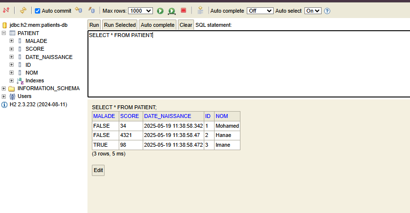
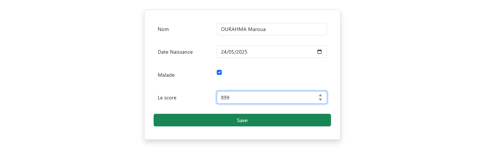

# Spring MVC

* Nom : OURAHMA.
* Prènom : Maroua.
* Filière : Master en Intelligence artificielle et sciences de données
* Universitè : Facultès des sciences Universitè Moulay Ismail Meknès.

## **1. Introduction**

Ce rapport présente le développement d'une application Web JEE basée 
sur le framework Spring MVC, intégrant les technologies Thymeleaf 
pour la partie front-end et Spring Data JPA pour la gestion de la 
persistance des données, en mettant en œuvre des 
fonctionnalités classiques d’une application de gestion, ainsi 
que des notions avancées telles que la pagination, la recherche 
dynamique, la validation de formulaires et la gestion de la 
sécurité avec Spring Security.
___
## **2. Enoncé**

Développer une application Web JEE de gestion des patients en utilisant :

- **Spring MVC** pour la gestion des contrôleurs et de la logique métier,

- **Thymeleaf** pour le rendu des pages web côté client,

- **Spring Data JPA** pour l’interaction avec la base de données relationnelle.

**Fonctionnalités attendues **

- Afficher la liste des patients avec pagination.
- Rechercher des patients par nom.
- Supprimer un patient de la base de données.
- Ajouter et modifier les patients avec validation des formulaires.
- Améliorations supplémentaires possibles (ex. tri, notifications, etc.).

**Partie sécurité (Spring Security) **
- L’application sera sécurisée à l’aide de Spring Security avec trois modes d’authentification :

    - **InMemory Authentication** (utilisateurs stockés en mémoire),
    - **JDBC Authentication** (utilisateurs stockés dans la base de données),
    - **UserDetailsService** personnalisé.

Les rôles `USER` et `ADMIN` permettront de restreindre l’accès à 
certaines fonctionnalités, comme la suppression de patients ou 
l’accès à l’interface d’administration.
___

## **3. Partie 1**
### Introduction :
La première étape du projet consiste à poser les bases de 
l’application en créant la structure principale : les entités, 
la base de données, les contrôleurs, ainsi que les vues HTML 
avec Bootstrap. L’objectif est de mettre 
en œuvre les opérations CRUD (Créer, Lire, Mettre à jour, Supprimer) 
sur une entité principale : `Patient`. Une fonctionnalité 
de recherche par nom ou partie du nom des patients est 
également intégrée, avec une interface utilisateur conviviale.

**1. Création de l'entité `Patient`**
- Définition de la classe Patient annotée avec `@Entity`, contenant 
des attributs comme `id`, `nom`, `dateNaissance`, `malade`, et `score`.
```java
package net.ourahma.entities;

import java.util.Date;

import jakarta.persistence.*;
import jakarta.validation.constraints.DecimalMin;
import jakarta.validation.constraints.NotEmpty;
import jakarta.validation.constraints.Size;
import lombok.AllArgsConstructor;
import lombok.Data;
import lombok.NoArgsConstructor;
import lombok.Builder;
import org.springframework.format.annotation.DateTimeFormat;


@Entity
@Data @NoArgsConstructor @AllArgsConstructor
@Builder
public class Patient {
    @Id @GeneratedValue(strategy = GenerationType.IDENTITY)
    private Long id;

    @NotEmpty
    @Size(min = 4, max = 40)
    private String nom;
    @Temporal(TemporalType.DATE)
    @DateTimeFormat(pattern = "yyyy-MM-dd")
    private Date dateNaissance;
    private boolean malade;
    @DecimalMin("100")
    private int score;
}

```
**Annotations Utilisées**

**Annotations JPA (Jakarta Persistence API)**

- `@Entity` : Indique que cette classe est une entité persistante, elle sera mappée à une table en base de données.
- `@Id` : Spécifie que le champ `id` est la clé primaire de l'entité.
- `@GeneratedValue(strategy = GenerationType.IDENTITY)` : La clé primaire est générée automatiquement par la base de données (auto-increment).
- `@Temporal(TemporalType.DATE)` : Indique que le champ `dateNaissance` est de type `DATE` en base de données (sans l'heure).
- `@DateTimeFormat(pattern = "yyyy-MM-dd")` : Permet de formater la date lors de la saisie ou l'affichage au format `YYYY-MM-DD`.
---

**Annotations Lombok**

Lombok permet de générer automatiquement du code répétitif comme les getters, setters, constructeurs, etc.

- `@Data` : Génère automatiquement les getters, setters, `toString`, `equals`, `hashCode`, etc.
- `@NoArgsConstructor` : Génère un constructeur sans arguments.
- `@AllArgsConstructor` : Génère un constructeur avec tous les champs.
- `@Builder` : Permet de construire facilement des objets avec le pattern Builder.

**Exécution**
- La table des patients est affiché dans la base de données après avoir ajouté des patients en tuilisant l'objet de `CommandLineRunner`
```java
package net.ourahma;

import net.ourahma.entities.Patient;
import net.ourahma.repository.PatientRepository;
import org.springframework.beans.factory.annotation.Autowired;
import org.springframework.boot.CommandLineRunner;
import org.springframework.boot.SpringApplication;
import org.springframework.boot.autoconfigure.SpringBootApplication;
import org.springframework.context.annotation.Bean;
import org.springframework.security.crypto.bcrypt.BCryptPasswordEncoder;
import org.springframework.security.crypto.password.PasswordEncoder;

import java.util.Date;

@SpringBootApplication
public class Hospital2Application  {
    @Autowired
    private PatientRepository patientRepository;
    public static void main(String[] args) {
        SpringApplication.run(Hospital2Application.class, args);
    }

    //@Bean
    CommandLineRunner commandLineRunner(PatientRepository patientRepository) {
        return args -> {
            // trois façons pour insérer des patients
            // 1 ere méthode
            Patient patient = new Patient();
            patient.setId(null);
            patient.setNom("OURAHMA");
            patient.setDateNaissance(new Date());
            patient.setMalade(false);
            patient.setScore(23);
            //patientRepository.save(patient);

            // 2 eme méthode
            Patient patient2 = new Patient(null,"OURAHMA MAROUA",new Date(),false, 123);
            //patientRepository.save(patient2);

            // 3 eme méthode : en utilisant builder
            Patient patient3= Patient.builder()
                    .nom("Maroua")
                    .dateNaissance(new Date())
                    .score(56)
                    .malade(true)
                    .build();
            //patientRepository.save(patient3);

            patientRepository.save(new Patient(null,"Mohamed",new Date(),false,134));
            patientRepository.save(new Patient(null,"Hanae",new Date(),false,4321));
            patientRepository.save(new Patient(null,"Imane",new Date(),true,198));
            patientRepository.findAll().forEach(p ->{
                System.out.println(p.getNom());
            });
        };
    }
}

```
- Les patients sont bien ajoutés dans la base de données comme indiqué içi:


**2. Mise en place de la couche DAO **

- Création de l’interface `PatientRepository` qui étend `JpaRepository<Patient, Long>`.
- Définition d’une méthode personnalisée pour la recherche :
```java
package net.ourahma.repository;

import lombok.AllArgsConstructor;
import net.ourahma.entities.Patient;
import org.springframework.data.domain.Page;
import org.springframework.data.domain.Pageable;
import org.springframework.data.jpa.repository.JpaRepository;
import org.springframework.data.jpa.repository.Query;
import org.springframework.data.repository.query.Param;
import org.springframework.stereotype.Repository;

@Repository
public interface PatientRepository extends JpaRepository<Patient, Long> {
    Page<Patient> findByNomContains(String keyword, Pageable pageable);

    @Query("select p from Patient p where p.nom like :x")
    Page<Patient> chercher(@Param("x") String x, Pageable pageable);
}
```
- **Annotations utilisées dans PatientRepository**

  - `@Repository` : Marque l'interface comme un repository Spring, permettant la gestion automatique par le framework.
  - `@Query` : Permet d’écrire une requête JPQL personnalisée (au lieu d'utiliser les méthodes générées automatiquement).
  - `@Param` : Associe un paramètre de méthode à un paramètre nommé dans une requête JPQL.

- **3. Création du contrôleur web (`PatientController`)**
  Chaque méthode du contrôleur gère une action spécifique dans l'application :

- `index(Model model, @RequestParam...)`  
  Affiche la liste paginée des patients. Permet également de faire une recherche par nom.
- `delete(@RequestParam...)`  
  Supprime un patient par son ID.

- `home()`  
  Redirige la racine du site (`/`) vers la page d'accueil des patients.
- `listPatients()`  
  Retourne une liste de tous les patients.
- `formPatient(Model model)`  
  Affiche le formulaire d'ajout d'un nouveau patient. Réservé aux administrateurs.

- `save(Model model, @Valid Patient patient, BindingResult...)`  
  Enregistre un nouveau patient ou met à jour un existant après validation des données du formulaire.
- `editPatient(Model model, Long id, String keyword, int page)`  
  Charge les informations d’un patient existant pour modification.
```java
package net.ourahma.web;

import jakarta.validation.Valid;
import lombok.AllArgsConstructor;
import net.ourahma.entities.Patient;
import net.ourahma.repository.PatientRepository;
import org.springframework.beans.factory.annotation.Autowired;
import org.springframework.data.domain.Page;
import org.springframework.data.domain.PageRequest;
import org.springframework.security.access.prepost.PreAuthorize;
import org.springframework.stereotype.Controller;
import org.springframework.ui.Model;
import org.springframework.validation.BindingResult;
import org.springframework.web.bind.annotation.GetMapping;
import org.springframework.web.bind.annotation.PostMapping;
import org.springframework.web.bind.annotation.RequestParam;

import java.util.List;

@Controller
@AllArgsConstructor
public class PatientController {

    @Autowired
    private PatientRepository patientRepository;

    @GetMapping("/index")
    public String index(Model model,
                        @RequestParam(name = "page", defaultValue = "0") int page ,
                        @RequestParam(name = "size", defaultValue = "4") int size,
                        @RequestParam(name = "keyword", defaultValue = "") String kw ){
        // @RequestParam(name = "page"): on lui dit va chercher un paramètre qui s appemme page
        // sans faire la pagination
        //List<Patient> patientList= patientRepository.findAll();
        // integrer la pagination
        Page<Patient> pagePatients= patientRepository.findByNomContains(kw, PageRequest.of(page, size));
        // en utilisant getContent, le contenu de la page est retourné à ce point là est la liste des patients
        model.addAttribute("Listpatients", pagePatients.getContent());
        // stocker le nombre de pages
        model.addAttribute("pages",new int[pagePatients.getTotalPages()]);
        // stocker la page courante pour la colorier
        model.addAttribute("currentPage",page);
        // stocker la valeur de keyword pour l 'affichier après
        model.addAttribute("keyword",kw);
        return "Patients";
    }
    // supprimer les patients
    @GetMapping("/delete")
    @PreAuthorize("hasRole('ROLE_ADMIN')")
    public String delete(@RequestParam(name="id") Long id,
                          @RequestParam(name = "keyword", defaultValue = "") String keyword,
                          @RequestParam(name = "page", defaultValue = "0") int page){
        patientRepository.deleteById(id);
        return "redirect:/user/index?page="+page+"&keyword="+keyword;
    }
    //
    @GetMapping("/")
    public String home(){
        return "redirect:/user/index";
    }
    @GetMapping("/patients")
    public List<Patient> listPatients(){
        return patientRepository.findAll();
    }

    @GetMapping("/formPatients")
    @PreAuthorize("hasRole('ROLE_ADMIN')")
    public String formPatient(Model model){
        model.addAttribute("patient", new Patient());
        return "formPatients";
    }

    @PostMapping("/save")
    @PreAuthorize("hasRole('ROLE_ADMIN')")
    public String save(Model model, @Valid Patient patient, BindingResult bindingResult,
                       @RequestParam(name = "keyword", defaultValue = "") String keyword,
                       @RequestParam(name = "page", defaultValue = "0") int page){
        if(bindingResult.hasErrors()){
            return "formPatients";
        }else{
            model.addAttribute("keyword", keyword);
            model.addAttribute("page", page);
            patientRepository.save(patient);
            return "redirect:/user/index?page="+page+"&keyword="+keyword;
        }
    }
    @GetMapping("/editPatient")
    public String editPatient(Model model, Long id, String keyword, int page){
        Patient patient = patientRepository.findById(id).orElse(null);
        if(patient == null)throw new RuntimeException("Patient introuvable");
        model.addAttribute("patient", patient);
        model.addAttribute("keyword", keyword);
        model.addAttribute("page", page);
        return "editPatients";
    }
}

```
**Annotations utilisées dans PatientController**

- `@Controller` : Indique que cette classe est un contrôleur Spring MVC (retourne des noms de vues).
- `@GetMapping` : Mappe une méthode sur une requête HTTP GET avec l'URL spécifiée.
- `@PostMapping` : Mappe une méthode sur une requête HTTP POST.
- `@RequestParam` : Récupère un paramètre depuis l’URL (ex: ?page=1).
- `@Valid` : Déclenche la validation d’un objet selon les contraintes définies.
- `@PathVariable` : Récupère une variable directement depuis l’URL (non utilisé ici, mais courant).
- `@ModelAttribute` : Lie les données du formulaire à un objet Java (non présent ici, mais souvent utilisé).

**4. La page `patients.html` **
```html
<!DOCTYPE html>
<html lang="en" xmlns:th="http://www.thymeleaf.org"
      xmlns:layout="http://www.ultraq.net.nz/thymeleaf/layout"
        >
<head>
    <meta charset="UTF-8">
    <title>Patients</title>
    <link rel="stylesheet" href="/webjars/bootstrap/5.3.5/css/bootstrap.min.css">
    <link rel="stylesheet" href="/webjars/bootstrap-icons/1.11.1/font/bootstrap-icons.css">
</head>
<body>
<div class="p-3">
    <div class="card">
        <div class="card-header">Liste Patients</div>
        <div class="card-body">
            <form method="get" th:action="@{/user/index}">
                <label >Keyword : </label>
                <input class="form-control-sm" type="text" name="keyword" th:value="${keyword}">
                <button type="submit" class="btn btn-info">
                    <i class="bi bi-search"></i>
                </button>
            </form>
            <table class="table">
                <thead>
                <th>ID</th><th>Nom</th><th>Date</th><th>Malade</th><th>Score</th>


                <tr th:each="p:${Listpatients}">
                    <td th:text="${p.id}"></td>
                    <td th:text="${p.nom}"></td>
                    <td th:text="${p.dateNaissance}"></td>
                    <td th:text="${p.malade}"></td>
                    <td th:text="${p.score}"></td>
                    <td th:if="${#authorization.expression('hasRole(''ADMIN'')')}">
                        <a
                                onclick="javascript:return confirm('Etes vous sure de vouloir supprimer ? ')"
                                th:href="@{/admin/delete(id=${p.id}, keyword=${keyword}, page=${currentPage})}"
                                class="btn btn-danger"><i class="bi bi-trash"></i> Supprimer patient</a>
                    </td>
                    <td th:if="${#authorization.expression('hasRole(''ADMIN'')')}">
                        <a
                                th:href="@{/admin/editPatient(id=${p.id}, keyword=${keyword}, page=${currentPage})}"
                                class="btn btn-success"><i class="bi bi-pen"></i> Editer patient</a>
                    </td>
                </tr>
                </thead>
            </table>
            <ul class="nav nav-pills">
                <li th:each="value, item:${pages}">
                    <a th:href="@{/user/index(page=${item.index}, keyword=${keyword})}"
                       th:class="${currentPage==item.index?'btn btn-info ms-1':'btn btn-outline-info ms-1'}"
                       th:text="${1+item.index}"></a>
                </li>
            </ul>
        </div>
    </div>

</div>
</body>
</html>
```

#### **L'exécution de cette partie**

- **Le résultat de l 'exéution avec pagination**
  - 
  - la page patients.html donne la possibilité de supprimer, éditer un patient.
- **l'ajout des patients**
  - 
    - Cette page permet d'ajouter un patient en saisissant le nom, la date de naissance
    le checkbox pour checker si il est malade ou non et le score.
  
- **La rechercher des patients**
  - Cette page représente la possibilité de rechercher des personnes celon le 
  nom de patient, le paramètre keyword est ajouté au lien pour chercher dans
  la base de données en utilisant la méthode `findUserByNom` dans le Repository `PatientRepository`
  - 
- **La suppression des patients**
  - Cette fontionnalité est pour supprimer un patient après avoir confirmer la suppression en utilisant `javaScript`
  - 

- **L'édition d'un `Patient`**
  - Après selectionner un parient qu'on veut selctionner, le patient est cherché par sont Id est retourné à la page en utilisant le `Model`.
  - 
___
## **4. Partie 2**

**Annotations de Validation (Jakarta Validation)**

- `@NotEmpty` : Le champ `nom` ne peut pas être vide.
- `@Size(min = 4, max = 40)` : La taille du `nom` doit être entre 4 et 40 caractères.
- `@DecimalMin("100")` : Le `score` doit être supérieur ou égal à 100.

#### **L'exécution de cette partie**

- 
___
## **5. Partie 3**
___
## **6- Conclusion**
___
## **7- Auteur**

- **Nom:**  OURAHMA
- **Prénom:** Maroua
- **Courriel:** [Email](mailto:marouaourahma@gmail.com)
- **LinkedIn:** [Linkedin](www.linkedin.com/in/maroua-ourahma)